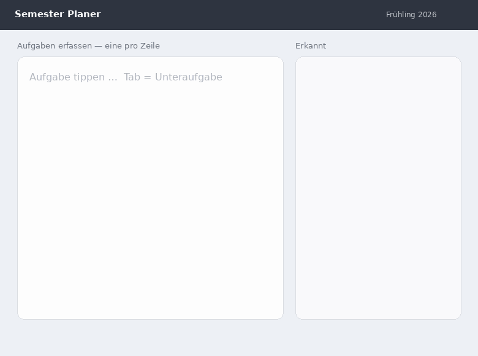

# Produktvision Semester Planer

Ein minimales Web-Tool, das Studierenden hilft, den Überblick über ihre Semestermodule zu behalten, ohne dafür konstant Aufwand in die Pflege des Tools zu stecken.

## Problem

Die Aufgaben und den persönlichen Stand von mehreren Module gleichzeitig im überblick zu halten ist unübersichtlich. Bestehende Tools wie Todoist oder Notion verlangen dutzende Klicks pro Aufgabe (Datumsangabe, Zeit, Prio, Titel, Beschreibung, Aufwand, Status, etc.) und konstante manuelle Pflege. Ausserdem um Termine von mehreren Aufgaben zu verschieben besteht dasselbe Problem, hoher Aufwand, weniger Operationen auf mehrere Aufgaben gleichzeitig möglich. Das Resultat ist, dass man gar nichts einträgt/verwaltet, weil es zu aufwändig ist, alles im Kopf behält und so über die Wochen den Überblick verliert.
herkömmliches mühsames eintragen:

## Zielgruppe

Studierende, die mehrere Module parallel führen und sich die Semesterarbeit schnell & strukturiert ihre offene Arbeit/Lernmaterialien einteilen wollen, ohne ein komplexes Projektmanagement-Tool lernen und pflegen zu müssen.

## Lösung

Semester Planer setzt auf eine vereinfachte Natural-Language-Eingabe, bei der Module und Unteraufgaben per Text in Bulk erfasst werden. Z.B. einmal pro Semesteranfang. Aufwandsangaben wie «2h» oder «half day» werden automatisch mit einer Vorgefertigten Bibliothek an Wörtern erkannt. Einmal Start- und Enddatum gesetzt, teilt die App die Aufgaben in planbare Abschnitte auf, die man per Drag-and-drop den verfügbaren Semesterwochen zuweist. Die Verwaltung in Wochen ist hier wichtig, da im Studium bei den Modulen auch in Wochen geplant wird. Eine Übersichtsseite zeigt jederzeit den aktuellen Stand aller Module auf einen Blick.
Ungefährer Leitfaden:

## Abgrenzung

Semester Planer ist kein vollständiges Projektmanagement-System. Komplexe Zeitplanung, freie Datumserkennung oder dutzende Integrationen sind bewusst nicht Teil der Kernidee. Der Fokus liegt auf das schnelle initiale Eintragen aller offenen Aufgaben. Und somit lange nicht mehr manuell Aufgaben eintragen zu müssen.