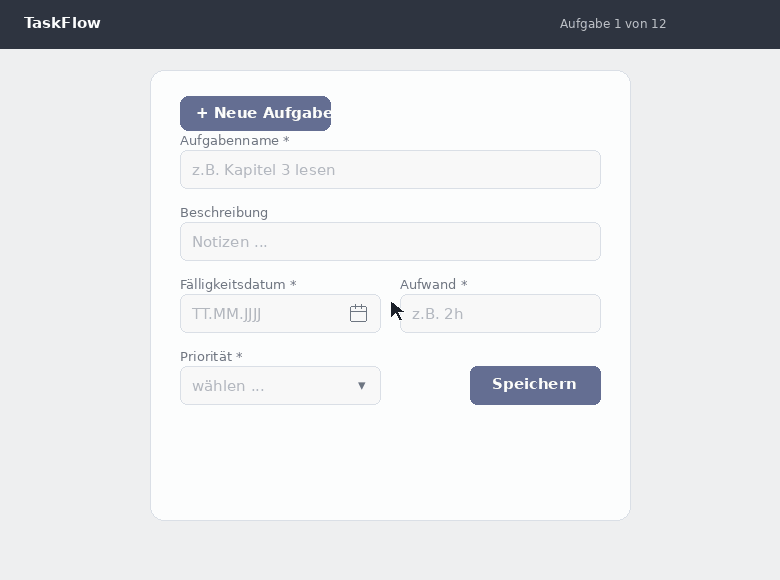

# Semester Planer - ipro

## meilensteinplan

### Übersicht
 
| Milestone | Zeitraum | ~Stunden | Status |
|---|---|---|---|
| M0 Vision & Vorbereitung | bis 13. Juni | 5h | ✅ abgeschlossen |
| M1 Interviews, Anforderungen & Scope | bis 30. Juni | ~15h | ✅ abgeschlossen |
| M2 Technologieentscheid & Learning neuer Technolgien | laufend | ~10h | ⬜ in progress |
| M3 Prototyp Skateboard (MVP-Kern) & Designprozess, entscheid | bis 14. Juli | ~35h | ⬜ |
| M4 User Evaulierungen, User Tests vom MVP | bis 21. Juli | ~10h | ⬜ |
| M5 Prototyp Roller (2. Iteration ) | bis 9. August | ~30h | ⬜ |
| M6 Feedback-Märkte, weiteres externes User Feedback | 10.–24. August | ~20h | ⬜ |
| M7 Prototyp Auto (Finalisierung, 3. Iteration) | bis 5. September | ~30h | ⬜ |
| M8 Erstellung Demo video / gifs | bis 5. September | ~5h | ⬜ |
| M9 Vorbereitung, Abgabe & Präsentation / Gespräch | 7. oder 10. September | ~10h | ⬜ |
| **Reserve** | laufend | ~10h | – |
| **Total** | | **~180h** | |

### Meilensteine
#### M0 - Vision & Vorbereitung
- Produktvision formulieren
- Problemdarstellung visuell aufbereiten (Vorher/Nachher-GIFs)
- ipro-Einführungstag besuchen & alle Projektinfos lesen
- Übersicht verschaffen, groben meilensteinplan definieren, was zu tun ist
- Repo & Doku aufsetzen

#### M1 - Interviews, Anforderungen & Scope
- 2-4 Interviews durchführen mit anderen studierenden, zur Problemvalidierung
- Anforderungen priorisieren (MVP vs. Later)
- Rationale dokumentieren (kritische Entscheidungen treffen & fragen klären)
- Erster Betreuungstermin.

#### M2 - Technologieentscheid & Learning neuer Technologien
2–3 Technologie-Kandidaten evaluieren, Entscheid treffen und begründen. Neue Technologie einarbeiten. läuft parallel zu M3 und wird iterativ angewendet.

#### M3 – Prototyp Skateboard & Designprozess
Ersten lauffähigen Prototyp bauen: MVP, nur die allernötigsten Features. Gleichzeitig Designentscheide & prozess (Wireframes, Komponenten, Farben, Anordnung, Designinspiration, recherche und Entscheid), die Design Iterationen werden direkt per codierten Prototyp durchgeführt, keine Hi- Fi Designs.
Zweiter Betreuungstermin

#### M4 - User Evaluierungen & Tests vom MVP
Skateboard mit 2–3 Personen testen. Beobachten, nicht erklären. Was funktioniert, was nicht, was fehlt? Erkenntnisse direkt in M5 einfliessen lassen.
Geht die App in eine komplett falsche Richtung? Ist die Grundidee unintuitiv? Erkenntnisse gewinnen!

#### M5 – Prototyp Roller (2. Iteration)
Zweite Iteration auf Basis der Testergebnisse aus M4. Kern stabilisieren oder komplett umändern, wichtigste Lücken schliessen. Falls Zeit neue Features, nice to have Features nach Prio starten. Für die Feedback-Märkte vorbereiten. Dritter Betreuungstermin.

#### M6 - Feedback-Märkte & externes User Feedback
Pflichttermine 17. und 24. August. Prototyp zeigen, strukturiert beobachten, Feedback sammeln. Erkenntnisse priorisieren für die finale Iteration.

#### M7 – Prototyp Auto (Finalisierung, 3. Iteration)
Letzte Iteration auf Basis Feedback-Markt. Falls Zeit, nice to have Features abschliessen. Designanpassungen anhand Feedbacks. Produkt fertigstellen.

#### M8 – Demo-Video / GIFs
Kurzes Demo-Video oder animierte GIFs erstellen, um den Kern des Produktes schnell visuell zu zeigen.

#### M9 – Vorbereitung, Abgabe & Präsentation
Alle Abgabeartefakte zusammenstellen, Dokumentation säubern & abschliessen, letzte Vorbereitungen für Ausstellung & Abschlussgespräch.

## Produktvision Semester Planer
Ein minimales Web-Tool, das Studierenden hilft, den Überblick über ihre Semestermodule zu behalten, ohne dafür konstant Aufwand in die Pflege des Tools zu stecken.

### Problem
Die Aufgaben und den persönlichen Stand von mehreren Module gleichzeitig im überblick zu halten ist unübersichtlich. Bestehende Tools wie Todoist oder Notion verlangen dutzende Klicks pro Aufgabe (Datumsangabe, Zeit, Prio, Titel, Beschreibung, Aufwand, Status, etc.) und konstante manuelle Pflege. Ausserdem um Termine von mehreren Aufgaben zu verschieben besteht dasselbe Problem, hoher Aufwand, weniger Operationen auf mehrere Aufgaben gleichzeitig möglich. Das Resultat ist, dass man gar nichts einträgt/verwaltet, weil es zu aufwändig ist, alles im Kopf behält und so über die Wochen den Überblick verliert.
herkömmliches mühsames eintragen:

### Zielgruppe
Studierende, die mehrere Module parallel führen und sich die Semesterarbeit schnell & strukturiert ihre offene Arbeit/Lernmaterialien einteilen wollen, ohne ein komplexes Projektmanagement-Tool lernen und pflegen zu müssen.

### Lösung
Semester Planer setzt auf eine vereinfachte Natural-Language-Eingabe, bei der Module und Unteraufgaben per Text in Bulk erfasst werden. Z.B. einmal pro Semesteranfang. Aufwandsangaben wie «2h» oder «half day» werden automatisch mit einer Vorgefertigten Bibliothek an Wörtern erkannt. Einmal Start- und Enddatum gesetzt, teilt die App die Aufgaben in planbare Abschnitte auf, die man per Drag-and-drop den verfügbaren Semesterwochen zuweist. Die Verwaltung in Wochen ist hier wichtig, da im Studium bei den Modulen auch in Wochen geplant wird. Eine Übersichtsseite zeigt jederzeit den aktuellen Stand aller Module auf einen Blick.
Ungefährer Leitfaden:

### Abgrenzung
Semester Planer ist kein vollständiges Projektmanagement-System. Komplexe Zeitplanung, freie Datumserkennung oder dutzende Integrationen sind bewusst nicht Teil der Kernidee. Der Fokus liegt auf das schnelle initiale Eintragen aller offenen Aufgaben. Und somit lange nicht mehr manuell Aufgaben eintragen zu müssen.

## interview

### Einleitung & Themeneinstieg
Die Teilnahme an diesem Interview ist freiwillig. Du kannst jederzeit abbrechen oder einzelne Fragen nicht beantworten, ohne dass dir daraus Nachteile entstehen.

Das Interview wird nicht aufgenommen, sondern nur transkribiert. Deine Antworten werden anonymisiert in einem öffentlichen Repository dokumentiert und im Rahmen meines individuellen Software Projektes an der FHNW zur Verbesserung der App verwendet. 

Die Daten aus allen Interviews, die ich durchführe, werden in wichtigste Erkenntnisse zusammengefasst (d.h. nicht personenspezifisch) und bleiben anonymisiert bis auf unbestimmte Zeit im öffentlichen Repository. Deine persönlichen Antworten werden nicht direkt öffentlich aufgezeigt. Falls du später möchtest, dass deine Angaben gelöscht werden, kannst du dich jederzeit bei mir melden. 

Für die Auswertung nutze ich teilweise KI-Tools wie Claude von Anthropic. Dabei werden Daten unter Umständen auf Servern im Ausland (z.B. USA) verarbeitet.

### Fragenkatalog
nicht nach Reihenfolge, Fragen je nach Antwort des Benutzers stellen.

- [ ] Welchen Studiengang, Schule? Wieviel Semester schon dabei, Voll- oder Teilzeit, wieviele Module gerade.

- [ ] kommst du nach mit allem was du für die schule machen musst / deinen Aufgaben der Schule? (Theorie, Aufgabenblätter, Projekte, Abgaben, lernen für Prüfungen, etc.)

- [ ] wie planst du dir dein Semester ein, oder gehst du mit dem flow bis kurz vor den Prüfungen / Abgaben?

- [ ] Was braucht es deiner Meinung nach, für eine erfolgreiche Vorbereitung für Prüfungen & Abgaben bis ende Semester.

- [ ] Wie sehen krisen Situationen für dich während dem Semester oder vor Prüfungen aus, und wie hat es dazu geführt?

- [ ] Hilft es dir zu wissen, wie andere Studierende ihr Semester angehen oder eher nicht?

- [ ] probierst du oft neue tools aus?

- [ ] Wie hälst du den Überblick über alles was offen ist, zu tun ist. / welche planungstools verwendest du bisher (papier, apps, sonstiges), schreibst du dir Aufgaben irgendwo auf?

- [ ] Was machst du wenn du hintendrin bist, mit den Dingen die du tun solltest für die Schule.

- [ ] Hilft es dir den Fortschritt und den Stand deiner Arbeit / Module zu sehen, wie siehst du aktuell deinen Fortschritt? 

- [ ] Was läuft bei deiner aktuellen Planung gut? Was eher nicht gut?

- [ ] Wann merkst du, dass du den Überblick verlierst / bist du dir manchmal unsicher, ob du on track bist mit allem? Wann verlierst du den Überblick, gibt es bestimmte Phasen im Semester, wo es eskaliert?

- [ ] Bei den bisherigen Tools die du verwendest oder verwendet hast, was nervt dich am meisten daran.
- [ ] was nervt dich beim eintragen & pflegen von aufgaben?

- [ ] was machst du wenn du Zwischentermine, die du dir gesetzt hast verpasst? Wie verhaltet sich das in deinem aktuellen System?

- [ ] Wenn ein Tool genau deinen Workflow abbilden würde, was würde diese Tool beinhalten, welche Funktionen hätte es?

- [ ] (*Gifs zeigen*, klingt das nach etwas, dass du dir vorstellen könntest zu nutzen? Was würde dich bremsen?)

### Interviewresultate

Siehe separates Dokument "interview_resultate.md".

## Wireframes

###
Wireframe v1, MVP:

## Technologieentscheid

### Frontend
Next.js. Mit jedem Frontend, kann man mehr oder weniger dasselbe machen. Hier muss ich das Rad nicht neu erfinden. 
- ich kenne Next.js bereits
- Server side rendering & API routes, kann ich gut gebrauchen für z. B. externe API Anbindungen
- einfaches publish auf vercel

#### Libraries

##### UI Library
shadcn
- sehr gute kompatibilität mit next.js
- minimalistisch
- tailwind customizing
- kenne ich bereits
MaterialUI wäre zu heavy für meinen use case.

##### State Library
| Kriterium | Zustand | Redux (Toolkit) | Gewichtung |
|---|---|---|---|
| Boilerplate | Minimal, 1 File | höher, Mehr Struktur nötig (actions, reducers, slicers) | Mittel |
| Lernkurve | Niedrig | hoch, Verständnis verschiedener Konzepte benötigt | Mittel |
| Bundle Size | Niedrig | höher | Niedrig |
| localStorage persistence | built in middleware | manuell oder über redux-persist | hoch |
| Skalierbarkeit bei komplexem State | Ausreichend für mittlere Komplexität | Hoch | Niedrig (für dieses Projekt) |
| DevTools / Debugging | Vorhanden, aber schlanker | Sehr ausgereift | Niedrig |
| Ökosystem / Community | Kleiner, aber aktiv | Grösser, mehr Ressourcen | Mittel |
| Migrationsaufwand zu Server-State später | Gering | Ähnlich gering, aber mehr Overhead | Mittel |
| Passung zum Scope (kein Server-State) | Sehr gut | Eher Overkill | Mittel |
| Relevanz auf dem Arbeitsmarkt | Tief | Hoch | Hoch |

Hier sieht man klar, dass sich State management mit Zustand mehr lohnt. Ich wollte zwar etwas grösseres neues lernen, was mir später auch weiterhelfen würde, aber da ich den Fokus auf user cenetered design & requirements engineering setzen möchte, denke ich wäre das Learning einer grossen library wie Redux unpassend in den Aufwand den ich übrig habe in diesem Projekt. Ausserdem wäre Redux für den Scope dieses Projektes sehr wahrscheinlich overkill. Falls ich Zeit habe könnte ich eine Migration von Zustand auf Redux durchführen, aber vorerst fahre ich mit Zustand weiter.

#### posthog - noch nicht entschieden
Posthog habe ich bisher noch nie verwendet. Ein grobes User tracking. Datenschutz müsste hier beachtet werden. Möglicherweise overkill für dieses Projekt, vorallem, da ich bereits viel Feedback erhalte von direkten Userinteraktionen.

#### LLM Anbindung - noch nicht entschieden
- Für besseres Natural Language Processing
- Für Ratschlag Gebung mit der aktuellen Einplanungen als Quelle
- Sonstiges Features
Ich lehne eher dagegen, da dies teuer werden kann und laut den User Interviews, User eher skeptisch gegenüber AI Features sind

### Eigenes Backend - noch nicht entschieden
Ich tendiere eher dagegen.
- Auth & Usermanagement kann ich mit next.js api routes und externen Anbietern einbinden
- Eigenes Auth mit eigenem Backend ist sehr unsicher
- Eher Overkill für ein kleines Studentenprojekt
- Ich will den Fokus auf User Centeres Design und Requirements Engineering (Modul ucdre) setzen, da habe ich auch viele Features geplant und werde da genügend zu tun haben

## Features

### MVP
| ID | Beschreibung | Prio | Aufwand |
|---|---|---|---|
| F01 | **Verwaltung** verschiedener **Module** | Hoch | Tief |
| F02 | **Bulk add Aufgaben/Unteraufgaben** pro Modul (vereinfachte Version), per grossem Rich text Feld und Language detection | Hoch | Hoch |
| F03 | **Bulk edit** Aufgaben/Unteraufgaben | Hoch | Hoch |
| F04 | **dnd Editor** der Aufgaben/Unteraufgaben, mindestens wochenbasiert von Start- bis Enddatum des Moduls | Hoch | Mittel | 
| F05 | **Overview page** <ul><li>Aufgaben Table view, mit Status</li><li>Fortschrittsanzeige aller Module</li></ul> | Hoch | Tief |
| F07 | **Aufgaben inbox View**, auf Overview Page & dnd Editor Preview | Hoch | Tief |
| F08 | **browser localStorage** Speicherung| Hoch | Tief |

### weitere Features / mögliche Features
| ID | Beschreibung | Wichtigkeit | Aufwand |
|---|---|---|---|
| Z01 | **pinned notes/dates view** | Mittel | Tief |
| Z02 | **Fokus Modus**. Alle Aufgaben ausser Einer werden ausgeblendet. mit kleinem Modal für Statussetzung | Mittel | Tief |
| Z03 | **verpasste Termine**, stets auf pendent heute verschieben | Hoch | Tief |
| Z04 | **automatische modal popups** von verpassten Aufgaben, auf Aufruf der website | Mittel | Tief |
| Z05 | **Overview page** Kalender View | Tief | Mittel |
| Z06 | **Overview page** Konfigurierbare Statistiken | Tief | Mittel |
| Z07 | **ai companion** gibt dir Beratung zu deiner aktuellen Planung | Mittel | Mittel |
| Z08 | **langzeit motivation** persönlichen text eintragen und einsehen können, nur eines | Mittel | Tief |
| Z14 | **Smart Hinweise**. Rückstände, wenn zu wenig Aufwand geplant wurde, die Zeit knapp werden könnte. Motivationshinweise je nach Aktivität, etc. | Hoch | Mittel
| Z11 | **User Tracking mit Posthog**, Datenschutz muss beachtet werden | Tief | Hoch |
| Z12 | **DB** Speicherung, externes Tool (z.B. Firebase / SupaBase) oder eigene DB Instanz mit Backend Verbindung | Mittel | Mittel |
| Z13 | **User Verwaltung** externes Tool für Auth & Usermanagement (z.B. Firebase / SupaBase) z.B. Google SSO oder custom Backend | Mittel | Hoch | 
| Z09 | **image import**, import von Aufgaben | Tief | Hoch |
| Z10 | **html-, csv-, textimport**, import von Aufgaben | Tief | Mittel |

backlog:
- **ai Planungsassistent** kann für dich planen, einiges mehr natural language M Möglichkeiten. grosse aufgabe.
- **externe Kalenderintegration** (google, apple, microsoft)
- **Social Features** Freunde hinzufügen. Eigene Planung & Profil teilen können
- ...

### Brainstorming (Entwurf)
- A | bulk add aufgaben mit einem textfeld, statt mit mehreren input feldern, Natural language detection (zuerst minimal), drag n drop aufgaben über mehrere wochen des zeitplanes/kalenders
    - für schnelle eintragung und planung
- A | Bulk bearbeitung erlauben, auch über das eine textfeld, drag n drop
    - Interviews: das Verwalten & kontinuierliche pflegen während dem Semester (ansehen, editieren, priorisieren, kategorisieren) hingegen als eigentlicher Aufwand
- B | pinned dates/notes section
    - Interviews: bei Gewissen wird von Semesterbeginn an alles im Kalender geplant (Prüfungen, Abgaben, Präsentationen, auch Freizeit)
- A | inbox view, von ungeplanten aufgaben (Aufgaben ohne Aufwand, datum)
    - Interviews: Gewisse wissen den Aufwand von Aufgaben anfang Semester gar nicht, müssen zuerst mal daran gearbeitet haben, damit sie eine genaue Planung / Aufwandsschätzung dafür erstellen können
- B | Einen Hinweis geben falls zu wenig aufwand geplant wurde für ein Modul. z. B. "ACHTUNG, für ein Modul mit 6 ects nach dem bologna system, müsstest du dir noch weitere 80h Aufwand einplanen"
    - Interviews: erhöhter druck & stress ende Semester, durch unter Anderem nicht ausreichender Planung
- A | verpasste termine werden stets automatisch auf den neuen heutigen tag verschoben
    - Interviews: bei Gewissen schwanken Energielevels tagesabhängig, starre Pläne wie "jeden Abend eine Übungsaufgabe lösen" werden dann oft nicht eingehalten
    - Interviews: verpasste Zwischentermine werden generell nicht aktiv nachverfolgt, bleiben stehen oder werden vergessen, allenfalls manuell neu eingeplant
- A | automatische popups um schnell verpasste aufgaben zu verschieben
    - Interviews: bei Gewissen schwanken Energielevels tagesabhängig, starre Pläne wie "jeden Abend eine Übungsaufgabe lösen" werden dann oft nicht eingehalten
    - Interviews: verpasste Zwischentermine werden generell nicht aktiv nachverfolgt, bleiben stehen oder werden vergessen, allenfalls manuell neu eingeplant
- A | usability tests durchführen, design iterationen durchführen (kein Feature)
    - Interviews: mangelnde Intuitivität schreckt ab, hohe lernkurve schreckt ab!
- B | ein fokus modus, bei denen alle Aufgaben ausser einer ausgeblendet werden
    - Interviews: bei Gewissen stressen weit entfernte Termine (z.B. in einem halben Jahr), bzw. weit entfernte Termine beinflussen schon ihre Leistung jetzt
- A | ein grossen dashboard mit allen visualisierungen die man auf einem blick sehen muss
    - Interviews: teilweise Unsicherheit, ob man "on track" ist
    - Interviews: sichtbarer Fortschritt wird bei allen Parteien als sehr positiv gegenüber motivation empfunden
- B | ein fenster zu haben, bei denen sich die user ihre persönliche langzeit motivation aufschreiben könnnen. kritisch datenschutz technisch.
    - Interviews: bei allen Parteien hilft es ein grösseres Ziel bzw. ein "Warum" zu haben, um so die motivation wiederzugewinnen in schwierigen Zeiten
- C | Integration auf externe Kalender, andere externe tools, sprengt aber den rahmen dieses modules
    - genutzt werden meist mehrere etablierte Tools parallel, selten nur ein Tool, sondern mehrere in Kombination
- C | ein marketing demo video erstellen, um die wichtigsten features, die mein produkt abheben zu zeigen (kein Feature)
    - Interviews: generell hohe Wechselhürde: ein neues Tool muss entweder eine klare Unzufriedenheit mit dem bestehenden lösen oder deutliche effizientsteigerung & besser Nutzerfreundlichkeit aufweisen. Viele haben bereits ihre fixe "Toolpalette"

- C | smart suggestions / tipps, basierend auf Planer Daten. z. B. "Du hast 4 Termine, die überfällig sind, deine Arbeit hat sich somit auf x Stunden in der Woche erhöht", "du arbeitest 16h heute, deine Arbeit könntest du dir besser aufteilen", "es empfiehlt sich aufgaben
    - ai chat, der dir ratschläge gibt, fragen beantwortet zu deinen Termindaten
- C | ai aufgaben import, per screenshot, html, csv, link, text etc.
- C | social features
- ...

## Rationale / Fragenklärung / sonstige Entscheidungshilfe
Ich habe bemerkt, dass mir einige Fragen/Unklarheiten aufgetaucht sind während dem Vorbereiten dieses Projektes, die mit der Zeit viel Aufwand aufweisen und sich auch als wichtig erscheinen für die Laufbahn des Projektes. Deshalb dokumentiere ich sie hier. Dieser Abschnitt unterstützt auch als generelle Entscheidungshilfe.

### Fragen
**Da dieses Projekt hauptsächlich ein natural language bulk Aufgabenplaner ist, warum nicht einfach ein llm mit anbindung zum persönlichen Kalender benutzen?**
Ich habe nach dem einreichen der Projektidee gemerkt, dass es den grössten Teil meiner geplanten App bereits gibt, in Form von z. B. Gemini und Google Kalender. Es funktioniert auch relativ gut und sehr flexibel mit dem natural language.
- Der genannte Workflow ist zwar eine sehr gute Wahl, aber das editieren von einem bereits festgelegtem plan ist immernoch schwierig, sobald man mit der llm die bulk Kalendereinträge gemacht hat, bleiben bulk edits dennoch schwierig.
- Ich möchte User centered Design & Requirements Engineering üben & anwenden. Ist am einfachsten mit einer Produktivitätsapp
- ein Thema/Problematik, dass sehr nah zu mir ist, und deshalb werde ich dafür mehr motiviert sein, als z. B. ein Konsolen Snake Game o. Ä. zu entwickeln
- hat einen grossen Scope, bzw. fast unlimitierte Decke an Möglichkeiten/Features, weshalb ich einen KI gestützten gut anwenden und üben könnte
- Personalisierung & Persistence. Man kann mit den von letzten Monat eingetragener Planung, welches gestern ein wenig angepasst wurde, ziemlich einfach weitere Dinge machen, wie z.b. Auswertungen, Visualisierungen, etc.
- Es ist gute Übung für allgemein schnelle, iterative Softwareentwicklung
Aus diesen Gründen finde ich es trotzdem eine gute Idee