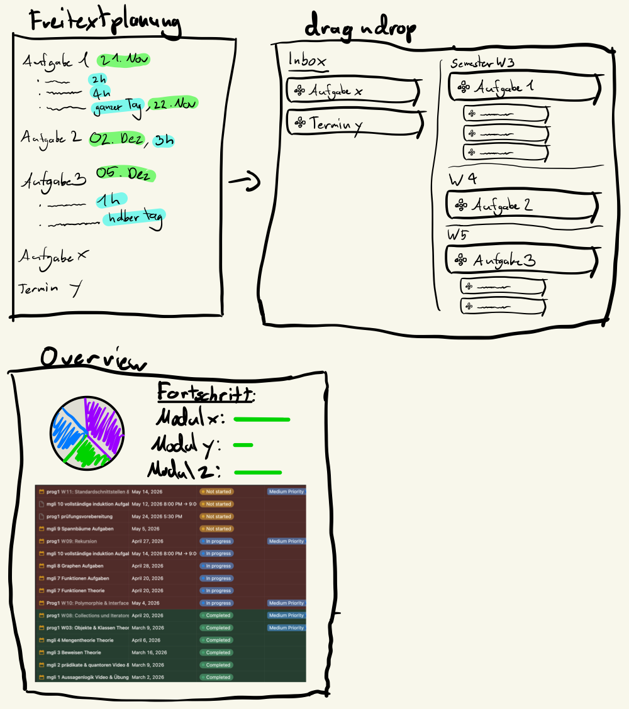
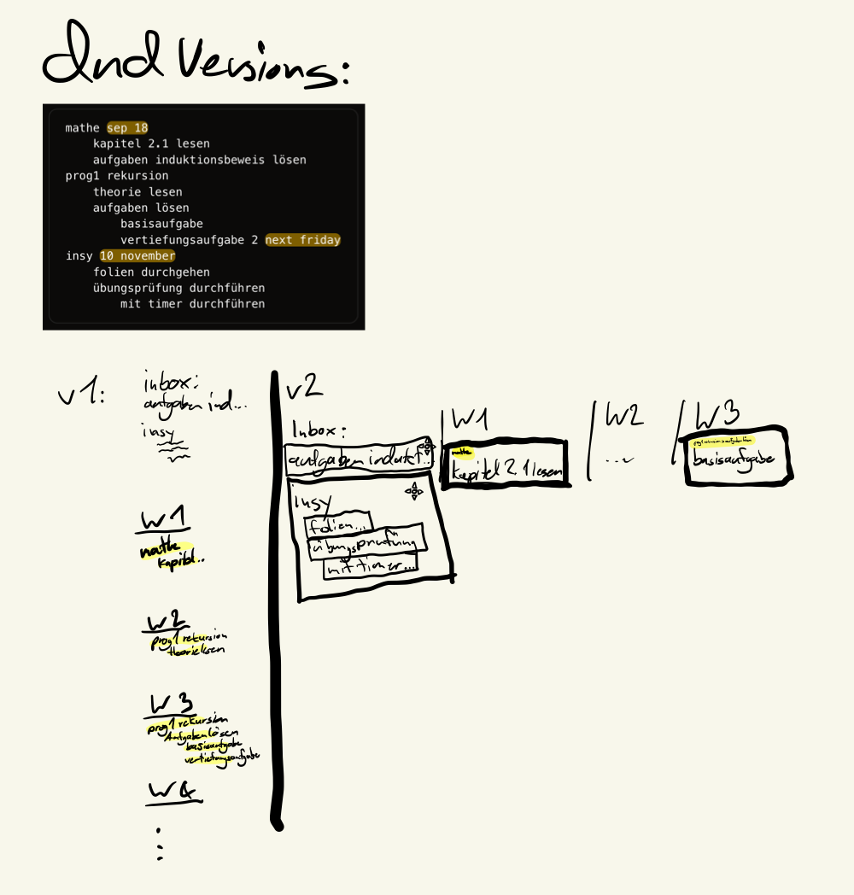

# Semester Planer - ipro

# Planung

## meilensteinplan

### Übersicht
 
| Milestone | Zeitraum | ~Stunden | Status |
|---|---|---|---|
| M0 Vision & Vorbereitung | bis 13. Juni | 5h | ✅ abgeschlossen |
| M1 Interviews, Anforderungen & Scope | bis 30. Juni | ~15h | ✅ abgeschlossen |
| M2 Technologieentscheid & Learning neuer Technolgien | laufend | ~10h | ⬜ in progress |
| M3 Prototyp Skateboard (MVP-Kern) & Designprozess, entscheid | bis 14. Juli | ~35h | ✅  |
| M4 User Evaulierungen, User Tests vom MVP | bis 21. Juli | ~10h | ⬜ |
| M5 Prototyp Roller (2. Iteration ) | bis 9. August | ~30h | ⬜ |
| M6 Feedback-Märkte, weiteres externes User Feedback | 10.–24. August | ~20h | ⬜ |
| M7 Prototyp Auto (Finalisierung, 3. Iteration) | bis 5. September | ~30h | ⬜ |
| M8 Erstellung Demo video / gifs | bis 5. September | ~5h | ⬜ |
| M9 Vorbereitung, Abgabe & Präsentation / Gespräch | 7. oder 10. September | ~10h | ⬜ |
| **Reserve** | laufend | ~10h | – |
| **Total** | | **~180h** | |

### Meilensteine
#### M0 - Vision & Vorbereitung
- Produktvision formulieren
- Problemdarstellung visuell aufbereiten (Vorher/Nachher-GIFs)
- ipro-Einführungstag besuchen & alle Projektinfos lesen
- Übersicht verschaffen, groben meilensteinplan definieren, was zu tun ist
- Repo & Doku aufsetzen

#### M1 - Interviews, Anforderungen & Scope | Verbindung zu ucdre Modul
- 2-4 Interviews durchführen mit anderen studierenden, zur Problemvalidierung
- Anforderungen priorisieren (MVP vs. Later)
- Rationale dokumentieren (kritische Entscheidungen treffen & fragen klären)
- Erster Betreuungstermin.

#### M2 - Technologieentscheid & Learning neuer Technologien
2–3 Technologie-Kandidaten evaluieren, Entscheid treffen und begründen. Neue Technologie einarbeiten. läuft parallel zu M3 und wird iterativ angewendet.

#### M3 – Prototyp Skateboard & Designprozess
Ersten lauffähigen Prototyp bauen: MVP, nur die allernötigsten Features. Gleichzeitig Designentscheide & prozess (Wireframes, Komponenten, Farben, Anordnung, Designinspiration, recherche und Entscheid), die Design Iterationen werden direkt per codierten Prototyp durchgeführt, keine Hi- Fi Designs.
Zweiter Betreuungstermin

#### M4 - User Evaluierungen & Tests vom MVP
Skateboard mit 2–3 Personen testen. Beobachten, nicht erklären. Was funktioniert, was nicht, was fehlt? Erkenntnisse direkt in M5 einfliessen lassen.
Geht die App in eine komplett falsche Richtung? Ist die Grundidee unintuitiv? Erkenntnisse gewinnen!

#### M5 – Prototyp Roller (2. Iteration)
Zweite Iteration auf Basis der Testergebnisse aus M4. Kern stabilisieren oder komplett umändern, wichtigste Lücken schliessen. Falls Zeit neue Features, nice to have Features nach Prio starten. Für die Feedback-Märkte vorbereiten. Dritter Betreuungstermin.

#### M6 - Feedback-Märkte & externes User Feedback
Pflichttermine 17. und 24. August. Prototyp zeigen, strukturiert beobachten, Feedback sammeln. Erkenntnisse priorisieren für die finale Iteration.

#### M7 – Prototyp Auto (Finalisierung, 3. Iteration)
Letzte Iteration auf Basis Feedback-Markt. Falls Zeit, nice to have Features abschliessen. Designanpassungen anhand Feedbacks. Produkt fertigstellen.

#### M8 – Demo-Video / GIFs
Kurzes Demo-Video oder animierte GIFs erstellen, um den Kern des Produktes schnell visuell zu zeigen.

#### M9 – Vorbereitung, Abgabe & Präsentation
Alle Abgabeartefakte zusammenstellen, Dokumentation säubern & abschliessen, letzte Vorbereitungen für Ausstellung & Abschlussgespräch.

## Produktvision Semester Planer
Ein minimales Web-Tool, das Studierenden hilft, den Überblick über ihre Semestermodule zu behalten, ohne dafür konstant Aufwand in die Pflege des Tools zu stecken.

### Problem
Die Aufgaben und den persönlichen Stand von mehreren Module gleichzeitig im überblick zu halten ist unübersichtlich. Bestehende Tools wie Todoist oder Notion verlangen dutzende Klicks pro Aufgabe (Datumsangabe, Zeit, Prio, Titel, Beschreibung, Aufwand, Status, etc.) und konstante manuelle Pflege. Ausserdem um Termine von mehreren Aufgaben zu verschieben besteht dasselbe Problem, hoher Aufwand, weniger Operationen auf mehrere Aufgaben gleichzeitig möglich. Das Resultat ist, dass man gar nichts einträgt/verwaltet, weil es zu aufwändig ist, alles im Kopf behält und so über die Wochen den Überblick verliert.
herkömmliches mühsames eintragen:

### Zielgruppe
Studierende, die mehrere Module parallel führen und sich die Semesterarbeit schnell & strukturiert ihre offene Arbeit/Lernmaterialien einteilen wollen, ohne ein komplexes Projektmanagement-Tool lernen und pflegen zu müssen.

### Lösung
Semester Planer setzt auf eine vereinfachte Natural-Language-Eingabe, bei der Module und Unteraufgaben per Text in Bulk erfasst werden. Z.B. einmal pro Semesteranfang. Aufwandsangaben wie «2h» oder «half day» werden automatisch mit einer Vorgefertigten Bibliothek an Wörtern erkannt. Einmal Start- und Enddatum gesetzt, teilt die App die Aufgaben in planbare Abschnitte auf, die man per Drag-and-drop den verfügbaren Semesterwochen zuweist. Die Verwaltung in Wochen ist hier wichtig, da im Studium bei den Modulen auch in Wochen geplant wird. Eine Übersichtsseite zeigt jederzeit den aktuellen Stand aller Module auf einen Blick.
Ungefährer Leitfaden:

### Abgrenzung
Semester Planer ist kein vollständiges Projektmanagement-System. Komplexe Zeitplanung, freie Datumserkennung oder dutzende Integrationen sind bewusst nicht Teil der Kernidee. Der Fokus liegt auf das schnelle initiale Eintragen aller offenen Aufgaben. Und somit lange nicht mehr manuell Aufgaben eintragen zu müssen.

## interview

### Einleitung & Themeneinstieg
Die Teilnahme an diesem Interview ist freiwillig. Du kannst jederzeit abbrechen oder einzelne Fragen nicht beantworten, ohne dass dir daraus Nachteile entstehen.

Das Interview wird nicht aufgenommen, sondern nur transkribiert. Deine Antworten werden anonymisiert in einem öffentlichen Repository dokumentiert und im Rahmen meines individuellen Software Projektes an der FHNW zur Verbesserung der App verwendet. 

Die Daten aus allen Interviews, die ich durchführe, werden in wichtigste Erkenntnisse zusammengefasst (d.h. nicht personenspezifisch) und bleiben anonymisiert bis auf unbestimmte Zeit im öffentlichen Repository. Deine persönlichen Antworten werden nicht direkt öffentlich aufgezeigt. Falls du später möchtest, dass deine Angaben gelöscht werden, kannst du dich jederzeit bei mir melden. 

Für die Auswertung nutze ich teilweise KI-Tools wie Claude von Anthropic. Dabei werden Daten unter Umständen auf Servern im Ausland (z.B. USA) verarbeitet.

### Fragenkatalog
nicht nach Reihenfolge, Fragen je nach Antwort des Benutzers stellen.

- [ ] Welchen Studiengang, Schule? Wieviel Semester schon dabei, Voll- oder Teilzeit, wieviele Module gerade.

- [ ] kommst du nach mit allem was du für die schule machen musst / deinen Aufgaben der Schule? (Theorie, Aufgabenblätter, Projekte, Abgaben, lernen für Prüfungen, etc.)

- [ ] wie planst du dir dein Semester ein, oder gehst du mit dem flow bis kurz vor den Prüfungen / Abgaben?

- [ ] Was braucht es deiner Meinung nach, für eine erfolgreiche Vorbereitung für Prüfungen & Abgaben bis ende Semester.

- [ ] Wie sehen krisen Situationen für dich während dem Semester oder vor Prüfungen aus, und wie hat es dazu geführt?

- [ ] Hilft es dir zu wissen, wie andere Studierende ihr Semester angehen oder eher nicht?

- [ ] probierst du oft neue tools aus?

- [ ] Wie hälst du den Überblick über alles was offen ist, zu tun ist. / welche planungstools verwendest du bisher (papier, apps, sonstiges), schreibst du dir Aufgaben irgendwo auf?

- [ ] Was machst du wenn du hintendrin bist, mit den Dingen die du tun solltest für die Schule.

- [ ] Hilft es dir den Fortschritt und den Stand deiner Arbeit / Module zu sehen, wie siehst du aktuell deinen Fortschritt? 

- [ ] Was läuft bei deiner aktuellen Planung gut? Was eher nicht gut?

- [ ] Wann merkst du, dass du den Überblick verlierst / bist du dir manchmal unsicher, ob du on track bist mit allem? Wann verlierst du den Überblick, gibt es bestimmte Phasen im Semester, wo es eskaliert?

- [ ] Bei den bisherigen Tools die du verwendest oder verwendet hast, was nervt dich am meisten daran.
- [ ] was nervt dich beim eintragen & pflegen von aufgaben?

- [ ] was machst du wenn du Zwischentermine, die du dir gesetzt hast verpasst? Wie verhaltet sich das in deinem aktuellen System?

- [ ] Wenn ein Tool genau deinen Workflow abbilden würde, was würde diese Tool beinhalten, welche Funktionen hätte es?

- [ ] (*Gifs zeigen*, klingt das nach etwas, dass du dir vorstellen könntest zu nutzen? Was würde dich bremsen?)

### Interviewresultate | Verbindung zu ucdre Modul

Siehe separates Dokument "interview_resultate.md".

## Wireframes | Verbindung zu ucdre Modul

###
Wireframe v1, MVP:

Wireframe dnd Erstversionen:

## Technologieentscheid

### KI gestützter Coding Workflow
Heutzutage ist ein KI gestützter coding Workflow gang und gäbe, um effizient Applikationen zu entwickeln. Und wird in der heutigen Zeit von Arbeitgeber meist auch vorausgesetzt.
Deshalb möchte ich diese Chance mit dem ipro Projekt verwenden, um diesen Workflow auszuprobieren. 
Ich habe ebenfalls eine relativ grosses App Konzept, wobei ich hoffe, dass ich mit diesem Workflow möglichst viel umsetzen kann.
Wichtig ist natürlich, dass man die Grenzen kennt:
- Man kann grössere Konzept-, Design- oder Architekturentscheidungen nicht blind KI überlassen.
- Man sollte den Code der AI Agents überprüfen & verstehen, aus offensichtlichen Gründen.
Es gibt etliche andere Dinge die man hierbei diskutieren kann, gesunder Menschenverstand ist hier meiner Meinung nach wichtig.

Für den Workflow verwende ich Claude Code.

### Frontend
Next.js. Mit jedem Frontend, kann man mehr oder weniger dasselbe machen. Hier muss ich das Rad nicht neu erfinden. 
- ich kenne Next.js bereits
- Server side rendering & API routes, kann ich gut gebrauchen für z. B. externe API Anbindungen
- einfaches publish auf vercel

#### Libraries

##### UI library
shadcn
- sehr gute kompatibilität mit next.js
- minimalistisch
- tailwind customizing
- kenne ich bereits
MaterialUI wäre zu heavy für meinen use case.

##### Natural language date & duration parser library
Hier war ich erstaunt, es gibt eine ziemlich klare Wahl für nlp Datum/Terminerkennung, 'chrono-node'.
Damit kann man dinge wie "next friday", "meeting tomorrow at 14:00" erkennen. Leider limitierter
deutsche Sprache Support.

Wiederkehrende Daten wie "every friday" kann chrono-node nicht erkennen. 
Allerdings könnte man theoretisch andere libraries, die das handeln kombinieren mit chrono-node.
'rrule' kann wiederkehrende Daten handhaben.

Für Aussagen wie "2h", oder "1h 10min", gibt es mehrere libraries jurations.js, parse-duration, js-duration-parser, hier versuche ich am besten mehrere aus.

##### State library
| Kriterium | Zustand | Redux (Toolkit) | Gewichtung |
|---|---|---|---|
| Boilerplate | Minimal, 1 File | höher, Mehr Struktur nötig (actions, reducers, slicers) | Mittel |
| Lernkurve | Niedrig | hoch, Verständnis verschiedener Konzepte benötigt | Mittel |
| Bundle Size | Niedrig | höher | Niedrig |
| localStorage persistence | built in middleware | manuell oder über redux-persist | hoch |
| Skalierbarkeit bei komplexem State | Ausreichend für mittlere Komplexität | Hoch | Niedrig (für dieses Projekt) |
| DevTools / Debugging | Vorhanden, aber schlanker | Sehr ausgereift | Niedrig |
| Ökosystem / Community | Kleiner, aber aktiv | Grösser, mehr Ressourcen | Mittel |
| Migrationsaufwand zu Server-State später | Gering | Ähnlich gering, aber mehr Overhead | Mittel |
| Passung zum Scope (kein Server-State) | Sehr gut | Eher Overkill | Mittel |
| Relevanz auf dem Arbeitsmarkt | Tief | Hoch | Hoch |

Hier sieht man klar, dass sich State management mit Zustand mehr lohnt. Ich wollte zwar etwas grösseres neues lernen, was mir später auch weiterhelfen würde, aber da ich den Fokus auf user cenetered design & requirements engineering setzen möchte, denke ich wäre das Learning einer grossen library wie Redux unpassend in den Aufwand den ich übrig habe in diesem Projekt. Ausserdem wäre Redux für den Scope dieses Projektes sehr wahrscheinlich overkill. Falls ich Zeit habe könnte ich eine Migration von Zustand auf Redux durchführen, aber vorerst fahre ich mit Zustand weiter.

#### posthog - noch nicht entschieden
Posthog habe ich bisher noch nie verwendet. Ein grobes User tracking. Datenschutz müsste hier beachtet werden. Möglicherweise overkill für dieses Projekt, vorallem, da ich bereits viel Feedback erhalte von direkten Userinteraktionen.

#### LLM Anbindung - noch nicht entschieden
- Für besseres Natural Language Processing
- Für Ratschlag Gebung mit der aktuellen Einplanungen als Quelle
- Sonstiges Features
Ich lehne eher dagegen, da dies teuer werden kann und laut den User Interviews, User eher skeptisch gegenüber AI Features sind

### Eigenes Backend - noch nicht entschieden
Ich tendiere eher dagegen.
- Auth & Usermanagement kann ich mit next.js api routes und externen Anbietern einbinden
- Eigenes Auth mit eigenem Backend ist sehr unsicher
- Eher Overkill für ein kleines Studentenprojekt
- Ich will den Fokus auf User Centeres Design und Requirements Engineering (Modul ucdre) setzen, da habe ich auch viele Features geplant und werde da genügend zu tun haben

## Features

### MVP
| ID | Beschreibung | Prio | Aufwand |
|---|---|---|---|
| F01 | **Verwaltung** verschiedener **Module** (Level 1 Tasks) | Hoch | Tief |
| F02 | **Bulk add Aufgaben/Unteraufgaben** pro Modul (vereinfachte Version), per grossem Rich text Feld und Language detection | Hoch | Hoch |
| F03 | **Bulk edit** Aufgaben/Unteraufgaben | Hoch | Hoch |
| F04 | **dnd Editor** **Preview** der Aufgaben/Unteraufgaben, mindestens wochenbasiert von Start- bis Enddatum des Moduls | Hoch | Mittel | 
| F05 | **Overview page** <ul><li>Aufgaben Table view, mit Status</li><li>Fortschrittsanzeige aller Module</li></ul> | Hoch | Tief |
| F07 | **Aufgaben inbox View**, auf Overview Page & dnd Editor Preview | Hoch | Tief |
| F08 | **browser localStorage** Speicherung| Hoch | Tief |

### weitere Features / mögliche Features
| ID | Beschreibung | Wichtigkeit | Aufwand |
|---|---|---|---|
| Z01 | **pinned notes/dates view** | Mittel | Tief |
| Z02 | **Fokus Modus**. Alle Aufgaben ausser Einer werden ausgeblendet. mit kleinem Modal für Statussetzung | Mittel | Tief |
| Z03 | **verpasste Termine**, stets auf pendent heute verschieben | Hoch | Tief |
| Z04 | **automatische modal popups** von verpassten Aufgaben, auf Aufruf der website | Mittel | Tief |
| Z05 | **Overview page** Kalender View | Tief | Mittel |
| Z06 | **Overview page** Konfigurierbare Statistiken | Tief | Mittel |
| Z07 | **ai companion** gibt dir Beratung zu deiner aktuellen Planung | Mittel | Mittel |
| Z08 | **langzeit motivation** persönlichen text eintragen und einsehen können, nur eines | Mittel | Tief |
| Z14 | **Smart Hinweise**. Rückstände, wenn zu wenig Aufwand geplant wurde, die Zeit knapp werden könnte. Motivationshinweise je nach Aktivität, etc. | Hoch | Mittel
| Z11 | **User Tracking mit Posthog**, Datenschutz muss beachtet werden | Tief | Hoch |
| Z12 | **DB** Speicherung, externes Tool (z.B. Firebase / SupaBase) oder eigene DB Instanz mit Backend Verbindung | Mittel | Mittel |
| Z13 | **User Verwaltung** externes Tool für Auth & Usermanagement (z.B. Firebase / SupaBase) z.B. Google SSO oder custom Backend | Mittel | Hoch | 
| Z09 | **image import**, import von Aufgaben | Tief | Hoch |
| Z10 | **html-, csv-, textimport**, import von Aufgaben | Tief | Mittel |

backlog:
- **ai Planungsassistent** kann für dich planen, einiges mehr natural language M Möglichkeiten. grosse aufgabe.
- **externe Kalenderintegration** (google, apple, microsoft)
- **Social Features** Freunde hinzufügen. Eigene Planung & Profil teilen können
- ...

### Brainstorming weitere Features nach den Interviews
- A | bulk add aufgaben mit einem textfeld, statt mit mehreren input feldern, Natural language detection (zuerst minimal), drag n drop aufgaben über mehrere wochen des zeitplanes/kalenders
    - für schnelle eintragung und planung
- A | Bulk bearbeitung erlauben, auch über das eine textfeld, drag n drop
    - Interviews: das Verwalten & kontinuierliche pflegen während dem Semester (ansehen, editieren, priorisieren, kategorisieren) hingegen als eigentlicher Aufwand
- B | pinned dates/notes section
    - Interviews: bei Gewissen wird von Semesterbeginn an alles im Kalender geplant (Prüfungen, Abgaben, Präsentationen, auch Freizeit)
- A | inbox view, von ungeplanten aufgaben (Aufgaben ohne Aufwand, datum)
    - Interviews: Gewisse wissen den Aufwand von Aufgaben anfang Semester gar nicht, müssen zuerst mal daran gearbeitet haben, damit sie eine genaue Planung / Aufwandsschätzung dafür erstellen können
- B | Einen Hinweis geben falls zu wenig aufwand geplant wurde für ein Modul. z. B. "ACHTUNG, für ein Modul mit 6 ects nach dem bologna system, müsstest du dir noch weitere 80h Aufwand einplanen"
    - Interviews: erhöhter druck & stress ende Semester, durch unter Anderem nicht ausreichender Planung
- A | verpasste termine werden stets automatisch auf den neuen heutigen tag verschoben
    - Interviews: bei Gewissen schwanken Energielevels tagesabhängig, starre Pläne wie "jeden Abend eine Übungsaufgabe lösen" werden dann oft nicht eingehalten
    - Interviews: verpasste Zwischentermine werden generell nicht aktiv nachverfolgt, bleiben stehen oder werden vergessen, allenfalls manuell neu eingeplant
- A | automatische popups um schnell verpasste aufgaben zu verschieben
    - Interviews: bei Gewissen schwanken Energielevels tagesabhängig, starre Pläne wie "jeden Abend eine Übungsaufgabe lösen" werden dann oft nicht eingehalten
    - Interviews: verpasste Zwischentermine werden generell nicht aktiv nachverfolgt, bleiben stehen oder werden vergessen, allenfalls manuell neu eingeplant
- A | usability tests durchführen, design iterationen durchführen, die App nicht überladen! (kein Feature)
    - Interviews: mangelnde Intuitivität schreckt ab, hohe lernkurve schreckt ab!
- B | ein fokus modus, bei denen alle Aufgaben ausser einer ausgeblendet werden
    - Interviews: bei Gewissen stressen weit entfernte Termine (z.B. in einem halben Jahr), bzw. weit entfernte Termine beinflussen schon ihre Leistung jetzt
- A | ein grossen dashboard mit allen visualisierungen die man auf einem blick sehen muss
    - Interviews: teilweise Unsicherheit, ob man "on track" ist
    - Interviews: sichtbarer Fortschritt wird bei allen Parteien als sehr positiv gegenüber motivation empfunden
- B | ein fenster zu haben, bei denen sich die user ihre persönliche langzeit motivation aufschreiben könnnen. kritisch datenschutz technisch.
    - Interviews: bei allen Parteien hilft es ein grösseres Ziel bzw. ein "Warum" zu haben, um so die motivation wiederzugewinnen in schwierigen Zeiten
- C | Integration auf externe Kalender, andere externe tools, sprengt aber den rahmen dieses modules
    - genutzt werden meist mehrere etablierte Tools parallel, selten nur ein Tool, sondern mehrere in Kombination
- C | ein marketing demo video erstellen, um die wichtigsten features, die mein produkt abheben zu zeigen (kein Feature)
    - Interviews: generell hohe Wechselhürde: ein neues Tool muss entweder eine klare Unzufriedenheit mit dem bestehenden lösen oder deutliche effizientsteigerung & besser Nutzerfreundlichkeit aufweisen. Viele haben bereits ihre fixe "Toolpalette"

- C | smart suggestions / tipps, basierend auf Planer Daten. z. B. "Du hast 4 Termine, die überfällig sind, deine Arbeit hat sich somit auf x Stunden in der Woche erhöht", "du arbeitest 16h heute, deine Arbeit könntest du dir besser aufteilen", "es empfiehlt sich aufgaben
    - ai chat, der dir ratschläge gibt, fragen beantwortet zu deinen Termindaten
- C | ai aufgaben import, per screenshot, html, csv, link, text etc.
- C | social features
- ...

## Designentscheide

### Fragen
**Wie instruiere / zeige ich Erstusern für was die App ist und wie man sie verwendet?**
In meinem v1 Wireframe habe ich auf der ersten Seite nur ein Textfeld, da werden die wenigsten direkt verstehen dass es sich um eine Planungsapp handelt,
bei der man bulk Aufgaben hinzufügen kann, jede Zeile eine Aufgabe ist und man per Tab Unteraufgaben erstellen kann.

Option 1: Placeholder ghost Text in der text area
Option 2: Tooltip neben dem text area Label
Option 3: Ein Previewvideo, bei dem alles grafisch erklärt wird
Option 4: Tutorial, bei dem der User Schritt für Schritt mit hervorgehebenen Elementen erklärt bekommt wie alles funktioniert.
Option 5: Ein Fragezeichen in der Navigation, bei der die App erklärt wird

## Rationale / Fragenklärung / sonstige Entscheidungshilfe
Ich habe bemerkt, dass mir einige Fragen/Unklarheiten aufgetaucht sind während dem Vorbereiten dieses Projektes, die mit der Zfeit viel Aufwand aufweisen und sich auch als wichtig erscheinen für die Laufbahn des Projektes. Deshalb dokumentiere ich sie hier. Dieser Abschnitt unterstützt auch als generelle Entscheidungshilfe.

### Fragen
**Da dieses Projekt hauptsächlich ein natural language bulk Aufgabenplaner ist, warum nicht einfach ein llm mit anbindung zum persönlichen Kalender benutzen?**
Ich habe nach dem einreichen der Projektidee gemerkt, dass es den grössten Teil meiner geplanten App bereits gibt, in Form von z. B. Gemini und Google Kalender. Es funktioniert auch relativ gut und sehr flexibel mit dem natural language.
- Der genannte Workflow ist zwar eine sehr gute Wahl, aber das editieren von einem bereits festgelegtem plan ist immernoch schwierig, sobald man mit der llm die bulk Kalendereinträge gemacht hat, bleiben bulk edits dennoch schwierig.
- Ich möchte User centered Design & Requirements Engineering üben & anwenden. Ist am einfachsten mit einer Produktivitätsapp
- ein Thema/Problematik, dass sehr nah zu mir ist, und deshalb werde ich dafür mehr motiviert sein, als z. B. ein Konsolen Snake Game o. Ä. zu entwickeln
- hat einen grossen Scope, bzw. fast unlimitierte Decke an Möglichkeiten/Features, weshalb ich einen KI gestützten gut anwenden und üben könnte
- Personalisierung & Persistence. Man kann mit den von letzten Monat eingetragener Planung, welches gestern ein wenig angepasst wurde, ziemlich einfach weitere Dinge machen, wie z.b. Auswertungen, Visualisierungen, etc.
- Es ist gute Übung für allgemein schnelle, iterative Softwareentwicklung
Aus diesen Gründen finde ich es trotzdem eine gute Idee

**Wann mache ich user Tests. nach Erstellung des MVP/Prototypen oder nach vollständigem 1.0?**
Nach dem Prototypen kann ich nur die Features testen lassen, usability z.b. nicht da dann das Design etc. nicht in der finalen Version sein wird.
Allerdings möchte ich auch Usability möglichst früh testen und Fehler erkennen, ohne das ich 180h in die falsche Richtung gehe

**teste ich die erste iteration mit der finalen iteration der app mit denselben personen oder mit neuen?**
Ich will Erstkontakte von Usern mit meiner App testen. Wenn Personen die App bereits kennen, teste ich nicht das was ich herausfinden möchte.

**Sollte ich eine genauere Planung erlauben, also z.b. eine Tagesplanung hinzufügen?** 

**Sollte der Text Editor nur rein als task capture funktionieren oder sollte der Bulk Edit auch damit gesteuert sein?**
Nachteile:
- Viel Synchronisierungsaufwand & mögliche Bugs
    - wiederkehrende Tasks z.B. "notizen durchlesen every friday". was wenn der user im dnd editor oder in der tabelle einen friday vom every friday task herausnimmt und der user zurück zum texteditor view geht? im text editor kann dann nicht mehr "notizen durchlesen every friday"
    -  

# Realisieren / Umsetzung

## Inputfeld zum planen

## Objekt / Datenstruktur

Um mit den eingegebenen Daten zu arbeiten, brauche ich ein Objekt / Datenstruktur. 
Als erstes habe ich an folgendes gedacht um mit den verschachtelten Aufgaben zu arbeiten.

export interface TaskItem {
  id: string;
  title: string;
  children?: TaskItem;
  ...
}

Allerdings würde es hier mühsam werden rekursiv die children durchzugehen könnte mühsam werden.
Es kommen noch folgende in Frage.

export interface TaskItem {
  id: string;
  title: string;
  childIds?: string;
  ...
}

export interface TaskItem {
  id: string;
  title: string;
  childIds?: string;
  parentId?: string;
  ...
}

export interface TaskItem {
  id: string;
  title: string;
  parentId?: string;
  ...
}

Nach ein wenig recherche, scheint die Version mit nur der parentId am besten für mich zu sein. Da ich später aus diesen Objekten eine Drag and Drop Komponente bauen möchte.
So müsste ich bei änderung des Parents von einem Objekt, bei Drag and Drop nur beim geschobenen Objekt die ParentId ändern und nicht ein Property bei zwei Objekten aktualisieren.
Parent und ChildIds im selben Objekt anzugeben ist auch redundant.

### Tasks Drag and Drop Weekview
Zuerst wollte ich meine originelle Idee mit dem Drag n Drop aus dem MVP nehmen, da die Lösung mit dem Tree Drag and Drop eher ambitiös war mit zu vielen Edge Cases.
Allerdings ist das Drag and Drop ein wichtiges Tool zur Planung, deshalb habe ich mit das dnd nochmals vereinfacht überlegt:

Spezifikationen erste dnd Version:
- dnd-kit/react benutzen, nicht dnd-kit-sortable-tree, da ich weg vom tree drag n drop gehe
- vertikal oder horizontal wöchentliche droppable Zonen
- Alle Tasks sind separat, keine tree Darstellung, auch child tasks
- Child tasks haben ein kleines Label auf ihrem Item z.b. prog1 > rekursion, welche die Parent Struktur anzeigt
- Noch keine 'bewege Parent, bewege auch deren children' Logik oder Darstellung
- Es wird auf einer separaten Seite sein, nicht neben dem Planungs Text Editor, so kann Synchronisierungsaufwand vermieden werden

#### Übersicht dnd-kit/react library
Benötigte Komponenten der dnd-kit/react library:
- DragDropProvider
- useDraggable oder useSortable
- useDroppable

**DragDropProvider**, alle dnd Komponenten müssen hier beinhaltet sein, der DragDropProvider koordiniert ebenfalls die Drag events.
**useDraggable**, macht aus einem Element ein draggable element. In meinem Fall müssen alle Tasks des Semesters draggable sein. 
**useSortable**, dasselbe wie useDraggable, allerdings mit sortier Funktionalität innerhalb von Wochen.
**useDroppable**, macht aus einem Element ein droppable Element, bei dem man draggable elemente einfügen kann. In meinem Fall sind es alle Wochen des Semesters, die dynamisch generiert werden, je nach Semesterlänge.

### allgemein edge cases
- wie werden Tasks mit mehreren datumsangaben gehandled?
- wie werden child Tasks die über dem datum des parents liegen gehandled?
- wiederkehrende Tasks (sofern es diese geben wird), wie "every friday notizen durchlesen"
    - sollten ausserhalb des Text Editors nicht bearbeitbar sein, wenn dann nur remove all
    - sollten innerhalb des Text Editors nicht überschrieben werden können mit anderen daten

## F03 Bulk Edit

Ursprünglich geplant: Bulk Edit über Text Editor. Nach MVP-Grossteil: mögliche Schwierigkeiten aufgefallen → genauer angeschaut.

### Bulk Edit per Text Editor: Nachteile
* dnd braucht eine stabile ID pro Task. Aktuell vergibt der Text Editor bei jedem onChange neue UUID -> dnd sieht es als "neuen" Task, Reihenfolge geht verloren, falls sortierung innerhalb droppable containern implementiert wurde. So ist concurrent Editing von Tasks, zwischen Tabelle, dnd und Text Editor nicht möglich.
* Datum-Problem: Datum muss im Text stehen, darf aber nicht gleichzeitig im Titel UND als store-property existieren -> sonst doppelt nach re-render. Bsp: "hausaufgaben tomorrow" -> "tomorrow" muss beim Speichern raus, sonst nach Reload "hausaufgaben 11. Mai tomorrow"
* unintuitiv am Anfang, kein bekanntes UI-Konzept -> Anleitung oder sonstiges nötig

### Bulk Edit per Text Editor: Vorteile
* USP, meine App ist so nicht "noch eine weitere Todo App"
* schnelles bulk editing: ctrl+x ganze Zeile, Tab mitten im Wort -> ganze Zeile einrücken, search&replace möglich. Shortcuts sehr gut erweiterbar, da der Text Editor, Code Mirror 6 ursprünglich ein Editor für Code ist
* unintuitiv, aber schnell gelernt (Text-Editor-Bedienung kennt jeder)
* übersichtlich: alle Tasks des Semesters auf einen Blick, UND direkt editierbar
* wenig Navigation zwischen Komponenten, wenig Klicks. Planungs-Flow bleibt so erhalten.

### Alternativen
**Table Bulk Edit** (evtl. collapsible parent rows): ungünstig
* kein schnelles re-parenting, re-ordering möglich, wie im Text Editor
* multi-task edits möglich, aber sehr klick-lastig -> genau das, was ich vermeiden möchte mit meiner app

**Text Editor Bulk Edit ohne Date/Status, nur Hierarchie/Reorder/Titel**:
* Schade um chrono-node, ungenutzt
* User müsste zwischen Fenstern wechseln (Datum, Subtasks) → Kontext-Switching, genau das, was vermieden werden soll

### Nebenentscheid: Tagesplanung
Zusätzlich zu Wochenplanung (dnd) auch Tagesplanung.
Aufwand: 2-6h. Task-Objekt arbeitet schon mit Datum-Property → nur neue droppable areas pro Wochentag nötig. Komplexer falls Sortierung innerhalb droppable areas persistiert werden muss (Store/Getter/Objekthandling an vielen Stellen betroffen). Vor Implementierung genauer planen.

### Entscheid Bulk Edit: komplett über Text Editor
Nach den genannten Vorteilen ist die Entscheidung klar für mich. Text Editor übernimmt neben Quick Capture auch komplette Task-Verwaltung. 
* eine View: Text Editor fetcht & stellt Tasks korrekt dar
* Status sichtbar & aktualisierbar
* Date & Status müssen aus Titel gecleaned werden — sonst z.B. "kapitel 2 lesen 28/09/26 :doing:" als Titel gespeichert → sichtbar in anderen App-Teilen als Tasktitel

## F05 ... Fortschrittsanzeige aller Module | Verbindung zu prog1 Modul
Dieses Feature ist spannend, da es direkt eine Verknüpfung zu prog1 darsellt. Ein kleines eingehäustes Feature, bei dem es darum geht einen rekursiven Algorithmus zu entwicklen, der den Fortschritt aller Module bzw. aller level 1 Task Items aufzeigt:

Ein Task gilt als 100% erledigt, wenn alle sub Tasks auch erledigt sind. Allerdings, wenn z. B. Task C1 erledigt ist zählt es nicht gleich viel zum Fortschritt wie wenn Task B3 oder Task B1 erledigt ist. Task A1 ist der Root Level 1 Task für den der Fortschritt gemessen wird (z. B. ein Modul). 
**Fall Task B1 ist erledigt:**
1 / (Anzahl Tasks auf diesem Level) -> 1 / 3. Der Progress Bar sollte um ein 1/3 hoch.
**Fall Task C1 ist erledigt:**
(1 / (Anzahl Tasks auf diesem Level)) * (die Brüche der vorherigen Levels) -> (1 / 2) * (1 / 3) = 1 / 6. Der Progress Bar sollte um ein 1 / 6 hoch.

Das Ganze wird hier wegen der unendlichen Child Struktur am besten rekursiv gemacht. Aktuell stimmt der Algorithmus den ich geschrieben habe noch nicht ganz, deswegen muss hier noch dahinter.

##  M3 Prototyp Skateboard verstpätete Erledigung
Diesen Meilenstein konnte ich erfolgreich nach Plan erledigen. Allerdings hatte ich ungefähr 15 Tage Verspätung. Ich habe die Zeit deutlich unterschätzt. Einbindung von Libraries & Komponenten die ich nicht kenne (dnd-kit, Code mirror, tanstack datatable) habe ich unterschätzt, regelmässig Gedanken für Umentscheidungen haben vorallem zur Verspätung geführt. Diese Erkenntnisse nehme ich für die nächsten Projekte mit, mehr Zeit für unbekanntes einplanen & den Scope kleiner einplanen, und vor allem dabei bleiben.

## M4 User Evaulierungen, User Tests vom MVP
Dies habe ich gestrichen, da ich eine Pause eingelegt habe von Anfang Juli bis mitte August. Ich habe in meinem Meilensteinplan, keine Pausen / Ferien eingeplant. Ich habe für den ganzen Sommer Arbeit eingeplant, das war nicht sehr geschickt. Das nehme ich auch für das nächste mal mit. Da der Feedbackmarkt auch bald ist, hat es für meine eigenen ersten User Validierungen keine grossen nutzen.